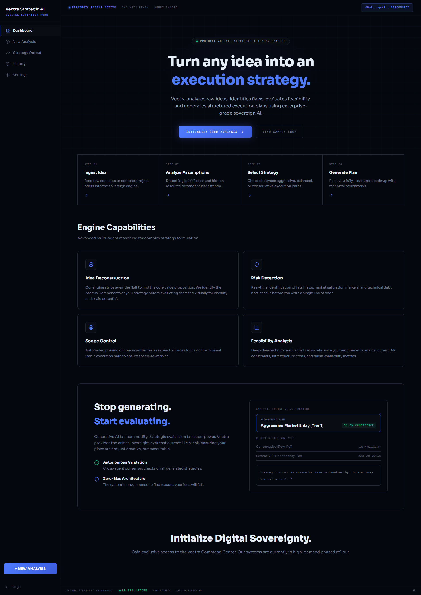

# Vectra Strategic AI

<p align="center">
  
</p>

<p align="center">
  <b>Decision engine for builders. Not another AI tool.</b>
</p>

<br/>

---

## What is Vectra

Vectra is a strategic intelligence system built for one specific problem:

builders often do not know if they are building the right thing.

You can spend days or weeks executing an idea, only to realize later that the direction was weak from the start.

Vectra exists to force that decision earlier.

Instead of giving vague suggestions, it breaks an idea down, exposes weak assumptions, identifies likely failure points, and ends with a clear verdict:

**EXECUTE**  
**RESTRUCTURE**  
**KILL**

---

## Why I built it

This project is personal.

One thing I have struggled with a lot is uncertainty during execution.

You get an idea, start building, and somewhere in the middle you begin questioning everything:

- Is this idea actually strong enough?
- Am I solving a real problem?
- Should I keep going or stop here?

Vectra was built to answer that before more time gets wasted.

---

## What Vectra does

<p align="center">
  
  
  
  
  
  
  
</p>

For every idea submitted, Vectra generates a structured report with:

### Strategic Reading
A plain explanation of what the idea actually is and what problem it claims to solve.

### Hidden Assumptions
The assumptions that must be true for the idea to work.

### Failure Points
The most likely reasons the idea fails in reality.

### Rejected Paths
Directions that may sound attractive but are weak or misleading.

### Winning Direction
The single path worth pursuing.

### Execution Plan
Clear next steps, not generic advice.

### Verdict
A direct decision:
**EXECUTE**, **RESTRUCTURE**, or **KILL**

---

## Core Features

<p align="center">
  
  
  
  
  
  
</p>

### Structured decision system
Vectra does not act like a general chatbot. It follows a fixed strategic structure and always ends with a verdict.

### Wallet based identity
User history is tied to wallet identity.  
A different wallet starts with a separate record and does not inherit previous analysis.

### Analysis hash
Each generated analysis includes a unique hash so the result can be verified as unchanged.

### Permanent report saving
Final reports can be saved permanently and accessed through a shareable link.

### Downloadable reports
Users can also download their analysis directly.

### Feasibility scoring
Each idea includes a score out of 100, paired with the final verdict.

---

## Why this matters

Most AI products help people generate more ideas.

Vectra is built to do something more useful:

**help builders decide whether an idea deserves execution at all.**

That matters because bad ideas do not only waste money.  
They waste time, focus, and momentum.

---

## Built on decentralized infrastructure

Vectra runs on **Nosana decentralized GPU infrastructure**.

This matters because the project is not just designed as an interface.  
It is actually deployed on decentralized compute infrastructure as part of the full stack.

Permanent report publishing is handled through IPFS-based storage for finalized outputs.

---

## Architecture

### Frontend
- Next.js
- App Router
- TypeScript
- Tailwind CSS

### AI Inference
- Qwen3.5-9B-FP8
- Nosana GPU infrastructure

### Storage
- Local wallet-scoped history
- Permanent report publishing for finalized analysis

---

## Project Structure

```text
agent-challenge/
├── frontend/              # Vectra Next.js application
├── characters/            # Agent character files
├── Dockerfile             # Agent/infrastructure Dockerfile
├── package.json           # Agent layer dependencies
└── README.md
